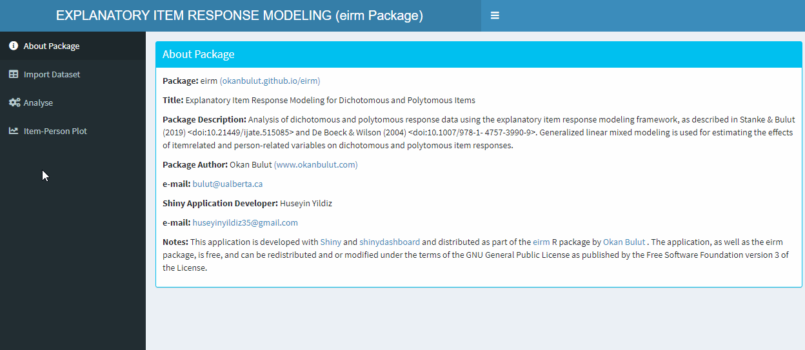
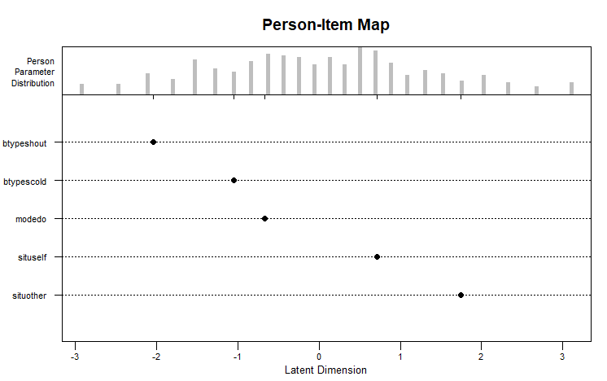

<!-- README.md is generated from README.Rmd. Please edit that file -->

# eirm: Explanatory Item Response Modeling 

[](https://github.com/okanbulut/eirm/actions)
[](https://www.codefactor.io/repository/github/okanbulut/eirm)
[](https://cran.r-project.org/package=eirm)
[](https://github.com/okanbulut/eirm)
[](https://cran.r-project.org/package=eirm)
[](https://doi.org/10.5281/zenodo.4556285)
[](https://github.com/okanbulut/eirm)

### Installing `eirm`

The stable version on CRAN can be installed by:

``` r
install.packages("eirm")
```

The development version can be installed by:

``` r
devtools::install_github(repo = "okanbulut/eirm")
```

**Note:** If you download the Github version and see the following
output on your console (or something similar), please choose `3: None`
from this list. You can simply type **3** in your `R` console and hit
“enter”.

``` r
Downloading GitHub repo okanbulut/eirm@master
These packages have more recent versions available.
Which would you like to update?

1: All                                      
2: CRAN packages only                       
3: None                                     
4: Rcpp      (1.0.1     -> 1.0.3    ) [CRAN]
5: RcppEigen (0.3.3.5.0 -> 0.3.3.7.0) [CRAN]
6: plyr      (1.8.4     -> 1.8.5    ) [CRAN]
7: stringi   (1.4.3     -> 1.4.5    ) [CRAN]

Enter one or more numbers, or an empty line to skip updates:
```

If this also fails, you can run the following lines all together and
select `3: None` by typing **3** in your `R` console:

``` r
Sys.setenv(R_REMOTES_NO_ERRORS_FROM_WARNINGS=TRUE)
devtools::install_github(repo = "okanbulut/eirm")
```

### Citing `eirm`

To cite `eirm` in your work, please use the following APA-style
citation:

> Bulut, O. (2020). *eirm: Explanatory item response modeling for
> dichotomous and polytomous item responses*, R package version 0.3.0.
> doi: 10.5281/zenodo.4556285 Available from
> <https://CRAN.R-project.org/package=eirm>.

------------------------------------------------------------------------

### Shiny GUI for `eirm`

You can use `eirmShiny()` to open the Shiny GUI for the `eirm` function:



### Example 1: Rasch model

The Rasch model (i.e., a fully descriptive model) can be estimated using
`eirm`. The following example shows how to estimate Rasch item
parameters for the verbal aggression data set (see `?VerbAgg` for
further details). A preview of the `VerbAgg` data set is shown below:

``` r
data("VerbAgg")
head(VerbAgg)

  Anger Gender        item    resp id btype  situ mode r2
1    20      M S1WantCurse      no  1 curse other want  N
2    11      M S1WantCurse      no  2 curse other want  N
3    17      F S1WantCurse perhaps  3 curse other want  Y
4    21      F S1WantCurse perhaps  4 curse other want  Y
5    17      F S1WantCurse perhaps  5 curse other want  Y
6    21      F S1WantCurse     yes  6 curse other want  Y
```

To estimate the Rasch model, a regression-like formula must be defined:
`formula = "r2 ~ -1 + item + (1|id)"`. In the formula,

-   `r2` is the variable for dichotomous item responses
-   `-1` removes the intercept from the model and yields parameter
    estimates for all items in the data set. With `1` (instead of `-1`),
    an intercept representing the parameter of the first item and
    relative parameters for the remaining items (i.e., distance from the
    parameter of the first item) would be estimated.
-   `item`is the variable representing item IDs in the data set
-   `(1|id)` refers to the random effects for persons represented by the
    `id` column in the data set.

The output for the Rasch model is shown below:

``` r
mod1 <- eirm(formula = "r2 ~ -1 + item + (1|id)", data = VerbAgg)
print(mod1)

EIRM formula: "r2 ~ -1 + item + (1|id)" 

Number of persons: 316 

Number of observations: 7584 

Number of predictors: 24 

Parameter Estimates:

                Easiness  S.E.  z-value  p-value
itemS1WantCurse   1.2211 0.161   7.5794 3.47e-14
itemS1WantScold   0.5648 0.153   3.7032 2.13e-04
itemS1WantShout   0.0801 0.150   0.5323 5.95e-01
itemS2WantCurse   1.7488 0.174  10.0632 8.03e-24
itemS2WantScold   0.7077 0.154   4.6020 4.18e-06
itemS2WantShout   0.0117 0.150   0.0779 9.38e-01
itemS3WantCurse   0.5295 0.152   3.4777 5.06e-04
itemS3WantScold  -0.6864 0.154  -4.4506 8.56e-06
itemS3WantShout  -1.5269 0.169  -9.0222 1.84e-19
itemS4wantCurse   1.0820 0.159   6.8193 9.15e-12
itemS4WantScold  -0.3494 0.151  -2.3062 2.11e-02
itemS4WantShout  -1.0440 0.159  -6.5628 5.28e-11
itemS1DoCurse     1.2211 0.161   7.5794 3.47e-14
itemS1DoScold     0.3896 0.151   2.5739 1.01e-02
itemS1DoShout    -0.8712 0.156  -5.5680 2.58e-08
itemS2DoCurse     0.8726 0.156   5.6063 2.07e-08
itemS2DoScold    -0.0567 0.151  -0.3766 7.06e-01
itemS2DoShout    -1.4819 0.168  -8.8152 1.19e-18
itemS3DoCurse    -0.2110 0.151  -1.3988 1.62e-01
itemS3DoScold    -1.5043 0.169  -8.9189 4.71e-19
itemS3DoShout    -2.9750 0.233 -12.7483 3.19e-37
itemS4DoCurse     0.7077 0.154   4.6020 4.18e-06
itemS4DoScold    -0.3842 0.152  -2.5328 1.13e-02
itemS4DoShout    -1.9995 0.184 -10.8750 1.52e-27

Note: The estimated parameters above represent 'easiness'.
Use difficulty = TRUE to get difficulty parameters.
```

By default, the `eirm` function returns the **easiness** parameters
because the function uses a regression model parameterization where
positive parameters indicate positive association with the dependent
variable. In order to print the difficulty parameters (instead of
easiness), `print(mod1, difficulty = TRUE)` must be used:

``` r
EIRM formula: "r2 ~ -1 + item + (1|id)" 

Number of persons: 316 

Number of observations: 7584 

Number of predictors: 24 

Parameter Estimates:

                Difficulty  S.E.  z-value  p-value
itemS1WantCurse    -1.2211 0.161   7.5794 3.47e-14
itemS1WantScold    -0.5648 0.153   3.7032 2.13e-04
itemS1WantShout    -0.0801 0.150   0.5323 5.95e-01
itemS2WantCurse    -1.7488 0.174  10.0632 8.03e-24
itemS2WantScold    -0.7077 0.154   4.6020 4.18e-06
itemS2WantShout    -0.0117 0.150   0.0779 9.38e-01
itemS3WantCurse    -0.5295 0.152   3.4777 5.06e-04
itemS3WantScold     0.6864 0.154  -4.4506 8.56e-06
itemS3WantShout     1.5269 0.169  -9.0222 1.84e-19
itemS4wantCurse    -1.0820 0.159   6.8193 9.15e-12
itemS4WantScold     0.3494 0.151  -2.3062 2.11e-02
itemS4WantShout     1.0440 0.159  -6.5628 5.28e-11
itemS1DoCurse      -1.2211 0.161   7.5794 3.47e-14
itemS1DoScold      -0.3896 0.151   2.5739 1.01e-02
itemS1DoShout       0.8712 0.156  -5.5680 2.58e-08
itemS2DoCurse      -0.8726 0.156   5.6063 2.07e-08
itemS2DoScold       0.0567 0.151  -0.3766 7.06e-01
itemS2DoShout       1.4819 0.168  -8.8152 1.19e-18
itemS3DoCurse       0.2110 0.151  -1.3988 1.62e-01
itemS3DoScold       1.5043 0.169  -8.9189 4.71e-19
itemS3DoShout       2.9750 0.233 -12.7483 3.19e-37
itemS4DoCurse      -0.7077 0.154   4.6020 4.18e-06
itemS4DoScold       0.3842 0.152  -2.5328 1.13e-02
itemS4DoShout       1.9995 0.184 -10.8750 1.52e-27

Note: The estimated parameters above represent 'difficulty'.
```

The `mod1` object is essentially a `glmerMod`-class object from the
`lme4` package ([Bates, Maechler, Bolker, & Walker,
2015](https://www.jstatsoft.org/article/view/v067i01)). All `glmerMod`
results for the estimated model can seen with `mod1$model`. For example,
estimated random effects for persons (i.e., theta estimates) can be
obtained using:

``` r
ranef(mod1$model)$id
```

------------------------------------------------------------------------

### Example 2: EIRM for dichotomous responses

The following example shows how to use item-related and person-related
explanatory variables to explain dichotomous responses in the verbal
aggression data set.

``` r
mod2a <- eirm(formula = "r2 ~ -1 + situ + btype + mode + (1|id)", data = VerbAgg)
print(mod2a)

EIRM formula: "r2 ~ -1 + situ + btype + mode + (1|id)" 

Number of persons: 316 

Number of observations: 7584 

Number of predictors: 5 

Parameter Estimates:

           Easiness   S.E. z-value   p-value
situother     1.744 0.1015   17.19  3.29e-66
situself      0.716 0.0978    7.32  2.43e-13
btypescold   -1.055 0.0680  -15.51  3.02e-54
btypeshout   -2.042 0.0729  -28.00 1.51e-172
modedo       -0.672 0.0562  -11.95  6.69e-33

Note: The estimated parameters above represent 'easiness'. Use difficulty = TRUE to get difficulty parameters.
```

It is possible to visualize the parameters using an item-person map
using `plot(mod2a)`, which returns the following plot. Note that this
plot is a modified version of the `plotPImap` function from the `eRm`
package ([Mair, Hatzinger, Maier, Rusch, & Debelak,
2020](https://cran.r-project.org/web/packages/eRm/index.html)).



Aesthetic elements such as axis labels and plot title can be added to
the plot. For example, the following code updates the x-axis label and
the main plot title (see `?plot.eirm` for further details).

``` r
plot(mod2a, difficulty = TRUE, main = "Verbal Aggression Example", latdim = "Verbal Aggression")
```

which will show the difficulty parameters (instead of easiness), change
the main title above the plot, and change the x-axis – the name for the
latent trait being measured.

Also, it is possible to compare nested explanatory models with each
other. The following example shows the estimation of a more compact
version of `mod2a` with one less variable and compares the two models
(i.e., `mod2a` vs. `mod2b`).

``` r
mod2b <- eirm(formula = "r2 ~ -1 + situ + btype + (1|id)", data = VerbAgg)
anova(mod2a$model, mod2b$model)

Data: data
Models:
mod2b$model: r2 ~ -1 + situ + btype + (1 | id)
mod2a$model: r2 ~ -1 + situ + btype + mode + (1 | id)

            Df  AIC  BIC logLik deviance Chisq Chi Df Pr(>Chisq)    
mod2b$model  5 8390 8424  -4190     8380                            
mod2a$model  6 8250 8292  -4119     8238   142      1     <2e-16 ***
---
Signif. codes:  0 ‘***’ 0.001 ‘**’ 0.01 ‘*’ 0.05 ‘.’ 0.1 ‘ ’ 1
```

------------------------------------------------------------------------

### Example 3: EIRM for polytomous responses

It is also possible to use the `eirm` function with polytomous item
responses as well. Because the function only accepts dichotomous
responses (i.e., binomial distribution), polytomous data must be
reformatted first. To reformat the data, the `polyreformat` function can
be used. The following example demonstrates how polytomous responses
(no, perhaps, and yes) in the verbal aggression data set can be
reformatted into a dichotomous form:

``` r
VerbAgg2 <- polyreformat(data=VerbAgg, id.var = "id", long.format = FALSE, var.name = "item", val.name = "resp")
head(VerbAgg2)

  Anger Gender        item    resp id btype  situ mode r2 polycategory polyresponse                polyitem
1    20      M S1WantCurse      no  1 curse other want  N  cat_perhaps            0 S1WantCurse.cat_perhaps
2    11      M S1WantCurse      no  2 curse other want  N  cat_perhaps            0 S1WantCurse.cat_perhaps
3    17      F S1WantCurse perhaps  3 curse other want  Y  cat_perhaps            1 S1WantCurse.cat_perhaps
4    21      F S1WantCurse perhaps  4 curse other want  Y  cat_perhaps            1 S1WantCurse.cat_perhaps
5    17      F S1WantCurse perhaps  5 curse other want  Y  cat_perhaps            1 S1WantCurse.cat_perhaps
6    21      F S1WantCurse     yes  6 curse other want  Y  cat_perhaps           NA S1WantCurse.cat_perhaps
```

In the reformatted data, `polyresponse` is the new dependent variable
(i.e., pseudo-dichotomous version of the original response variable
`resp`) and `polycategory` represents the response categories. Based on
the reformatted data, each item has two rows (number of response
categories - 1) based on the following rules (see [Stanke and Bulut
(2019)](https://dergipark.org.tr/en/download/article-file/716984) for
further details on this parameterization):

-   If `polycategory` = “cat\_perhaps” and `resp` = “no”, then
    `polyresponse` = 0
-   If `polycategory` = “cat\_perhaps” and `resp` = “perhaps”, then
    `polyresponse` = 1
-   If `polycategory` = “cat\_perhaps” and `resp` = “yes”, then
    `polyresponse` = NA

and

-   If `polycategory` = “cat\_yes” and `resp` = “no”, then
    `polyresponse` = NA
-   If `polycategory` = “cat\_yes” and `resp` = “perhaps”, then
    `polyresponse` = 0
-   If `polycategory` = “cat\_yes” and `resp` = “yes”, then
    `polyresponse` = 1

**NOTE:** Although `polyreformat` is capable of reshaping wide-format
data into long-format and reformat the long data for the analysis with
`eirm`, a safer option is to transform the data from wide to long format
before using `polyreformat`. The `melt` function from the `reshape2`
package can easily transform wide data to long data.

Several polytomous models can be estimated using the reformatted data:

**Model 1:** It explains only the first threshold (i.e., threshold from
no to perhaps) based on explanatory variables:

``` r
mod3 <- eirm(formula = "polyresponse ~ -1 + situ + btype + mode + (1|id)", data = VerbAgg2)
```

**Model 2:** It explains the first threshold (i.e., threshold from no to
perhaps) and second threshold (perhaps to yes) based on explanatory
variables:

``` r
mod4 <- eirm(formula = "polyresponse ~ -1 + btype + situ + mode + polycategory + polycategory:btype + (1|id)", 
             data = VerbAgg2)
```
